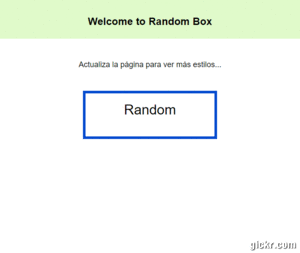

# RANDOM BOX

* **Track:** _FRONT-END-DEVELOPER_
* **Curso:** _REACT_
* **Unidad:** _2_

***

## Objetivo 

Random Box es un contenedor/caja que de manera aleatoria cambia de color y tamaño de texto cada vez que se recarga la página (F5).

## Especificaciones

Se utilizaron las siguientes herramientas de desarrollo web:
* HTML5
* CSS3
* ES6
* React

## Vista previa

